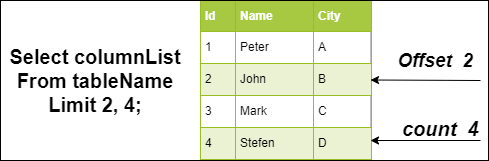

## Types of Clause --

<table>
<tbody>
<tr>
    <th>Clause</th>
    <th>Description</th>
</tr>
<tr>
    <td><a href="#distinctClause">Distinct Clause</a></td>
    <td>The DISTINCT clause is used to remove duplicate rows from the result set of a SELECT query. </td>
</tr>
<tr>
    <td><a href="#fromClause">From clause</a></td>
    <td>The FROM clause specifies the table or tables from which you want to retrieve data.</td>
</tr>
<tr>
    <td><a href="#whereClause">WHERE Clause</a></td>
    <td>The WHERE clause filters the rows returned by a query based on a specified condition.</td>
</tr>
<tr>
    <td><a href="#groupByClause">GROUP BY Clause</a></td>
    <td>The GROUP BY clause is used to group rows that have the same values into summary rows.</td>
</tr>
<tr>
    <td><a href="#havingClause">HAVING Clause</a></td>
    <td>The HAVING clause filters groups of rows returned by a GROUP BY clause based on a specified condition.</td>
</tr>
<tr>
    <td><a href="#orderByClause">ORDER BY Clause</a></td>
    <td>The ORDER BY clause is used to sort the result set in ascending or descending order based on one or more columns.</td>
</tr>
<tr>
    <td><a href="#limitClause">LIMIT Clause</a></td>
    <td>The LIMIT clause is used to limit the number of rows returned by a query.</td>
</tr>
<tr>
    <td><a href="#offsetClause">OFFSET Clause (with LIMIT)</a></td>
    <td>The OFFSET clause, when used with LIMIT, specifies the number of rows to skip before starting to return rows from the result set.</td>
</tr>
</tbody>
</table>


<!----------------- Distinct Clause Explaination ------------->
<h3 id="distinctClause">(A) Distinct Clause:</h3>

The **DISTINCT** clause is used to remove duplicate rows from the result set of a SELECT query. It ensures that only unique rows are returned, eliminating any duplicates that may exist in the original data. \
The **DISTINCT** clause applies to the entire **result set** of the query, not just individual columns. \
If you specify multiple columns in the **SELECT** statement, the **DISTINCT** clause will consider combinations of values across all specified columns when determining uniqueness.

### Syntax:
```sql
    SELECT DISTINCT column1, column2, ...
    FROM table_name;
```

### Example:
```sql
    -- Example with Single Columns:
    SELECT DISTINCT department
    FROM employees;

    -- Example with Multiple Columns:
    -- If you want to retrieve unique combinations of 'name' and 'department' from the employees table, you can use the DISTINCT clause with multiple columns:
    SELECT DISTINCT name, department
    FROM employees;
```


<!----------------- From Clause Explaination ------------->
<h3 id="fromClause">(B) From clause:</h3>

The FROM clause is used to specify the table or tables from which you want to retrieve data in a SELECT statement.

### Syntax:
```sql
    SELECT column1, column2, ...
    FROM table_name1, table_name2, ...;
```

### Example:
```sql
    SELECT customers.name
    FROM customers;
```


<!----------------- Where Clause Explaination ------------->
<h3 id="whereClause">(C) WHERE Clause:</h3>


The **WHERE** clause in MySQL is used to filter rows returned by a **SELECT, UPDATE** or **DELETE** statement based on a specified condition. 

### Syntax:
```sql
    SELECT column1, column2, ...
    FROM table_name
    WHERE [condition];
```

### Example:
```sql
    SELECT customers.name, orders.id
    FROM customers, orders
    WHERE customers.id = orders.customer_id;
            OR
    SELECT * FROM students
    WHERE age > 18;
```

**Note:** You can use logical operators (**AND, OR, NOT**) to combine multiple conditions in a WHERE clause for more complex filtering.
```sql
    SELECT * FROM products
    WHERE category = 'Electronics' AND price < 1000;
            OR
    SELECT * FROM products
    WHERE product_name LIKE 'iPhone%';
            OR
    SELECT * FROM orders
    WHERE customer_id IN (1, 2, 3);
```

<!----------------- Group By Clause Explaination ------------->
<h3 id="groupByClause">(D) GROUP BY Clause:</h3>

The **GROUP BY** clause is used to group rows that have the same values into summary rows, typically for **aggregation** purposes. It allows you to perform operations on groups of rows rather than on individual rows. \
Rows with **NULL** values in the grouping columns are grouped together into a single group.

### Syntax:
```sql
    SELECT column1, aggregate_function(column2), ...
    FROM table_name
    GROUP BY column1, column2, ...

    -- (*) means all rows in a table.
    -- COUNT(*) means count all rows in a table.
    -- SUM(*) generate an error.
```

Here's a simple breakdown:

- **Dividing the Similar Data into group:** Think of the **GROUP BY** clause as a tool that helps you divide your data into smaller groups. You specify which columns you want to use for grouping.
Rows with the same values in those columns get put into the same group.

- **Aggregating Within Groups:** Once the data is grouped, you can do things like counting, calculate sum, calculate average, or finding the minimum/maximum value within each group. \
This is where you often use functions like **COUNT(), SUM(), AVG(), MIN(), or MAX().**

- **Result:** After all the grouping and calculations, you end up with summary information for each group.

e.g.,

### **author table:**

| aut_id | aut_name             | country   | home_city      |
| ------ | -------------------- | --------- | -------------- |
| AUT001 | William Norton       | UK        | Cambridge      |
| AUT002 | William Maugham      | Canada    | Toronto        |
| AUT003 | William Anthony      | UK        | Leeds          |
| AUT004 | S.B.Swaminathan      | India     | Bangalore      |
| AUT005 | Thomas Morgan        | Germany   | Arnsberg       |
| AUT006 | Thomas Merton        | USA       | New York       |
| AUT007 | Piers Gibson         | UK        | London         |
| AUT008 | Nikolai Dewey        | USA       | Atlanta        |
| AUT009 | Marquis de Ellis     | Brazil    | Rio De Janerio |
| AUT010 | Joseph Milton        | USA       | Houston        |
| AUT011 | John Betjeman Hunter | Australia | Sydney         |
| AUT012 | Evan Hayek           | Canada    | Vancouver      |
| AUT013 | E. Howard            | Australia | Adelaide       |
| AUT014 | C. J. Wilde          | UK        | London         |
| AUT015 | Butler Andre         | USA       | Florida        |

### **Query:**
```sql
    SELECT country, COUNT(*)
    FROM author
    GROUP BY country;
```

### **Result:**

| country   | COUNT(*) |
| --------- | -------- |
| Australia | 2        |
| Brazil    | 1        |
| Canada    | 2        |
| Germany   | 1        |
| India     | 1        |
| UK        | 4        |
| USA       | 4        |

<center>


</center>


<!----------------- Having Clause Explaination ------------->
<h3 id="havingClause">(E) HAVING Clause:</h3>


The **HAVING** clause in MySQL is used to filter groups of rows returned by a **GROUP BY** clause based on a specified condition. It allows you to apply a condition to groups of rows after they have been aggregated using aggregate functions such as **COUNT(), SUM(), AVG()** etc.

The conditions in the **HAVING** clause can include **aggregate functions** and column aliases.

The **HAVING** clause is typically used to filter groups based on aggregate results, while the **WHERE** clause is used to filter individual rows before they are grouped.

### **Syntax:**
```sql
    SELECT column1, aggregate_function(column2), ...
    FROM table_name
    GROUP BY column1
    HAVING condition;
```

### **Example:**
```sql
    SELECT customer_id, COUNT(*) AS order_count, SUM(total_amount) AS total_spent
    FROM orders
    GROUP BY customer_id
    HAVING order_count > 1 AND total_spent > 1000;

    -- *  means all rows.
    -- COUNT(*)  means count all rows from a group of rows.
```


<!----------------- Order By Clause Explaination ------------->
<h3 id="orderByClause">(F) ORDER BY Clause:</h3>

The **ORDER BY** clause in MySQL is used to sort the result set of a query based on one or more columns. It arranges the rows returned by the query in either ascending (default) or descending order.

If you do not specify the sorting order (i.e., **ASC** or **DESC**), MySQL will sort the result set in ascending order by default.

If you specify multiple columns in the **ORDER BY** clause, MySQL will first sort the **result set** based on the first column, and then for rows with identical(same) values in the first column, it will sort them based on the second column, and so on.

The **ORDER BY** clause is not limited to simple column names; you can also use **expressions**, **functions**, or **aliases** in the clause.

### **Syntax:**
```sql
    ORDER BY column1 [ASC|DESC], column2 [ASC|DESC], ...;
```

### **Example:**
```sql
    -- Shorting in Acending Order
    SELECT * FROM products ORDER BY price;
    SELECT * FROM products ORDER BY price ASC;

    -- Shorting in Descending Order
    SELECT * FROM products ORDER BY price DESC;

    -- Shorting based on multiple column
    SELECT * FROM students ORDER BY grade DESC, name ASC;
```


<!----------------- Limit Clause Explaination ------------->
<h3 id="limitClause">(G) LIMIT Clause:</h3>

the LIMIT clause is used to restrict the number of rows returned by a query. It is particularly useful when dealing with large result sets where you only need to retrieve a subset of the rows. 

The Limit clause works with the SELECT statement for returning the specified number of rows only. This query accepts only one or two arguments, and their values should be zero or any positive integer.

### **Syntax:**
```sql
    SELECT column1, column2, ...
    FROM table_name
    LIMIT number;
```

**Count:** It specifies the maximum number of rows you want to return. It is the name of the column that you want to return.



### **Example:**
```sql
    -- Selecting the first 10 rows of products table
    SELECT id, name, price
    FROM products
    ORDER BY price
    LIMIT 10;
```


<!----------------- Offset Clause Explaination ------------->
<h3 id="offsetClause">(H) OFFSET Clause (with LIMIT):</h3>

The **LIMIT** clause with the **OFFSET** parameter is used to restrict the number of rows returned by a query while also specifying the starting point from which to retrieve rows. 

You can also use the **OFFSET** parameter with **LIMIT** to skip a certain number of rows before starting to return rows from the result set. The offset of the row starts from 0, not 1.

The **OFFSET** parameter is optional.

### **Syntax:**
```sql
    SELECT column1, column2, ...
    FROM [table_name]
    LIMIT [number] OFFSET [offset];
             OR
    SELECT column1, column2, ...
    FROM [table_name]
    LIMIT [from_row], [to_row];
```

- **number**: The maximum number of rows to return in the result set.
- **offset:** The number of rows to skip before starting to return rows from the result set.

### **Example:**
```sql
    -- skip first 15 rows(offsetting them) of product table and then retrieves the next 10 rows (limiting the result set to 10 rows). 
    SELECT id, name, price
    FROM products
    ORDER BY id
    LIMIT 10 OFFSET 15;

    -- skip first 9 rows of product table and then retrieves the data from 10th row to 15th row.
    -- e.g., 10, 11, 12, 13, 14, 15
    SELECT id, name, price
    FROM products
    ORDER BY id
    LIMIT 10, 15;
```